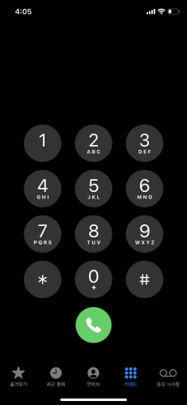

# View Layout

## LinearLayout

## RelativeLayout

## FrameLayout

## ConstraintLayout

## 연습문제

:smile_cat:[Source](https://github.com/EduProgramming/KotlinAndroidBegin/tree/example/layout)

---

대략적으로나마 디자인 버튼만 완성해본 결과 너무 번거롭습니다.

이후에 `Recycler View`를 통해서 이러한 번거로움을 쉽게 해결할 수 있을 것입니다.