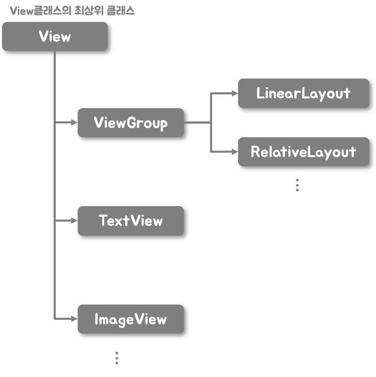

# View

## 뷰 객체의 계층 구조



- View: 모든 뷰 클래스의 최상위 클래스

- ViewGroup: 자체 UI는 없어서 화면에 출력해도 아무것도 나오지 않습니다.

  ​					다른 뷰 여러 개를 묶어서 제어할 목적으로 사용합니다.


[https://en.wikipedia.org/wiki/Composite_pattern](https://en.wikipedia.org/wiki/Composite_pattern)


### TextView

- autoLink: 문자열에 자동 링크를 추가

​		속성값으로는 web, phone, email 등을 사용할 수 있습니다.

```kotlin
<TextView
        android:layout_width="wrap_content"
        android:layout_height="wrap_content"
        android:text="이메일: jtj0525@gmail.com / 전화번호: 010-0000-0000 / 주소: https://github.com/TaeJuneJoung"
        android:autoLink="email|phone|web"
        app:layout_constraintEnd_toEndOf="parent"
        app:layout_constraintStart_toStartOf="parent"
        app:layout_constraintTop_toBottomOf="@+id/frameLayout" />
```

- maxLines: 특정 줄까지만 나오도록 할 때 사용
- ellipsize: 문자열이 더 있다는 것을 표시하기 위해 줄임표 표시됨


### ImageView

- adjustViewBounds: true로 설정하면 이미지의 가로세로 길이와 비례해 뷰의 크기를 맞춤

​		maxWidth와 maxHeight속성과 같이 쓰이면 좋습니다.


### EditText

- inputType: phone으로 설정시에 전화번호 입력모드로 올라오게 됩니다.

:man:기종에 따라 안되는 경우도 발생합니다.


| 속성값              | 설명                                                         |
| ------------------- | ------------------------------------------------------------ |
| none                | 입력 유형을 지정하지 않은 상태. 모든 문자 입력 가능하며 줄바꿈 가능 |
| text                | 문자열 한 줄 입력                                            |
| textCapCharacters   | 대문자 입력 모드                                             |
| textCapWords        | 각 단어의 첫 글자 입력 시 키보드가 자동으로 대문자 입력 모드 |
| textCapSentences    | 각 문단의 첫 글자 입력 시 키보드가 자동으로 대문자 입력 모드 |
| textMultiLine       | 여러 줄 입력 가능                                            |
| textNoSuggestions   | 단어 입력 시 키보드의 추천 단어를 보여 주지 않음             |
| textUri             | URL 입력 모드                                                |
| textEmailAddress    | 이메일 주소 입력 모드                                        |
| textPassword        | 비밀번호 입력 모드. 입력한 문자를 점으로 표시. 키보드는 영문자와 숫자, 특수 키만 표시 |
| textVisiblePassword | textPassword와 같으며 입력한 문자 표시                       |
| number              | 숫자 입력 모드                                               |
| numberSigned        | number와 같으며 부호 키인 마이너스(-) 입력 가능              |
| numberDecimal       | number와 같으며 소숫점 입력 가능                             |
| numberPassword      | 숫자 키만 입력 가능. 입력한 문자는 점으로 표시               |
| phone               | 전화번호 입력 모드                                           |


## View Binding

레이아웃 XML파일에 선언한 뷰 객체를 코드에서 쉽게 이용하는 방법

[https://developer.android.com/topic/libraries/view-binding](https://developer.android.com/topic/libraries/view-binding)


**build.gradle(Module)**

ardroid 내부에 추가

```bash
buildFeatures {
	viewBinding = true
}
```

레이아웃 XML 파일에 등록된 뷰 객체를 포함하는 클래스가 자동으로 만들어집니다.


**activity_main.xml**

```xml
<?xml version="1.0" encoding="utf-8"?>
<androidx.constraintlayout.widget.ConstraintLayout xmlns:android="http://schemas.android.com/apk/res/android"
    xmlns:app="http://schemas.android.com/apk/res-auto"
    xmlns:tools="http://schemas.android.com/tools"
    android:layout_width="match_parent"
    android:layout_height="match_parent"
    tools:context=".MainActivity">

    <TextView
        android:id="@+id/textView"
        android:layout_width="wrap_content"
        android:layout_height="wrap_content"
        android:text="textView"
        app:layout_constraintEnd_toEndOf="parent"
        app:layout_constraintStart_toStartOf="parent"
        app:layout_constraintTop_toTopOf="parent"
        app:layout_constraintBottom_toBottomOf="parent"/>

    <Button
        android:id="@+id/button"
        android:layout_width="wrap_content"
        android:layout_height="wrap_content"
        android:layout_marginTop="30dp"
        android:text="Button"
        app:layout_constraintEnd_toEndOf="parent"
        app:layout_constraintStart_toStartOf="parent"
        app:layout_constraintTop_toBottomOf="@+id/textView" />

</androidx.constraintlayout.widget.ConstraintLayout>
```


**MainActivity.kt**

```kotlin
import androidx.appcompat.app.AppCompatActivity
import android.os.Bundle
import com.june.myapplication.databinding.ActivityMainBinding

class MainActivity : AppCompatActivity() {
    override fun onCreate(savedInstanceState: Bundle?) {
        super.onCreate(savedInstanceState)
        val binding = ActivityMainBinding.inflate(layoutInflater) // 바인딩 객체 획득
        setContentView(binding.root) // 액티비티 화면 출력

        binding.button.setOnClickListener {
            if (binding.textView.text == "textView") {
                binding.textView.text = "onClick"
            } else {
                binding.textView.text = "textView"
            }
        }
    }
}
```

inflate함수를 호출하면 바인딩 객체를 얻을 수 있습니다.


바인딩 클래스를 만들 필요가 없는 레이아웃에서는 `tools:viewBindingIgnore="true"`라는 속성을 추가하면 됩니다.


:smile_cat:[github source](https://github.com/EduProgramming/KotlinAndroidBegin/tree/feature/viewBinding)
