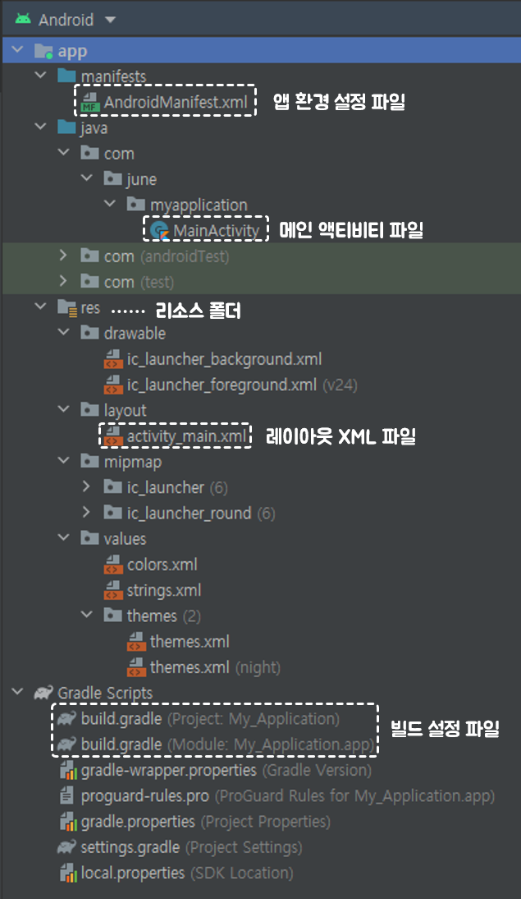

# Hello, Android

---

## 배포 파일

- APK
- AAB

> **AAB 방식**
>
> : APK방식과 달리 사용자 기기에 필요한 파일만 다운받음
>
> 2018년 구글 IO에서 발표한 새로운 안드로이드 앱 배포 파일


## 안드로이드 클래스

안드로이드 클래스는 크게 컴포넌트 클래스와 일반 클래스로 구별됩니다.

런타임 때 생명주기를 누가 관리하느냐에 따라 구별됩니다.

- **일반 클래스**: 생명주기를 <u>개발자 코드</u>에서 관리

- **컴포넌트 클래스**: 생명주기를 <u>안드로이드 시스템</u>에서 관리


### 컴포넌트 클래스

컴포넌트 클래스는 아래와 같이 구분됩니다.

- **액티비티, Activity**
- **서비스, Service**
- **콘텐츠 프로바이더, ContentProvider**
- **브로드캐스트 리시버, BroadcastReceiver**

#### 1. Activity

화면을 구성하는 컴포넌트


#### 2. Service

백그라운드 작업을 하는 컴포넌트

화면과 상관없이 백그라운드에서 장시간 실행해야 할 업무를 담당합니다.


#### 3. ContentProvider

앱의 데이터를 공유하는 컴포넌트

ex)


만들어본 앱으로는 Blockly에서 파일 저장/불러오기 기능을 만들 때 `contentResolver`를 사용하였는데,

**ContentProvider**를 통해서 데이터를 접근할 때에는 Context에서 ContentResolver 객체를 사용하여 데이터 제공자에 접근합니다.

<small>추후 공부해볼 요소: **ContentProvider**와 **ContentResolver**</small>


#### 4. BroadcastReceiver

시스템 이벤트가 발생할 때 실행되게 하는 컴포넌트

사용자가 만든 이벤트(ex. 클릭, 터치 이벤트 등)가 아니라 시스템에서 발생하는 특정 상황

ex) 부팅 완료, 배터리 방전


#### 컴포넌트 독립 실행 단위

**컴포넌트는 앱 안에서 독립된 실행 단위**입니다.

**독립된 실행 단위**란 <u>컴포넌트끼리 서로 종속되지 않아서 코드 결합이 발생하지 않는다</u>는 의미입니다.

ex) MainActivitiy에서 ChatActivity를 실행할 때 MainActivity에서 ChatActivity의 객체를 생성해서 실행하면 될 것이라 생각하지만,

안드로이드에서는 이 방법이 불가능합니다. 컴포넌트의 생명주기를 안드로이드 시스템에서 관리하기에 직접 객체를 생성하여

실행할 수 없습니다.

즉, 이말은 MainActivity에서 ChatActivity를 실행해야 한다면 안드로이드 시스템을 통해야 한다는 것입니다.


#### 안드로이드 실행시점

안드로이드의 실행시점은 다양합니다.

즉, 안드로이드 앱에는 메인 함수 개념이 없습니다.

ex) 알림앱의 경우에는 앱을 클릭해서 들어가는 방법도 있고, 알림 메시지를 통해서 바로 해당 부분으로 들어갈 수도 있습니다.


#### 리소스 활용

안드로이드 앱 개발은 리소스를 많이 이용합니다.

여기서 리소스란, 문자열, 색상, 크기, 레이아웃, 이미지, 메뉴 등이 있습니다.

또한 이미지 등 몇몇을 제외하면 대부분 리소스들은 XML파일로 작성합니다.


## 앱 구성 파일



`build.gradle`의 경우 Project와 Module 설정으로 나뉘어져 있습니다.

하나의 프로젝트에는 여러 개의 모듈을 추가할 수 있습니다.

모듈은 앱 단위이므로 새로운 모듈을 추가한다는 것은 새로운 앱을 개발하는 것과 같습니다.


### build.gradle(Module)

**플러그인 선언**

```bash
plugins {
    id 'com.android.application'
    id 'kotlin-android'
}
```


**앱의 식별자 설정**

android -> defaultConfig -> applicationId

```bash
applicationId "com.example.myapplication"
```

배포 단계에서 앱의 식별자가 `com.example`이라면 문제가 생깁니다.

`example`이 다른 명칭으로 바뀌어야 합니다.


**SDK버전 설정**

android -> defaultConfig -> minSdk / targetSdk

```bash
minSdk 26
targetSdk 31
```

`minSdk` 최소 지원 sdk 버전

`targetSdk` 해당 sdk버전으로 개발한다는 의미

> :question:그렇다면 minSdk를 1로 해서 모든 SDK를 다 지원하면 되지 않습니까?
>
> :man:하위 버전에도 오류가 발생하지 않게 개발하는 것을 **하위 호환성**이라고 합니다.
>
> 하위 호환성을 지켜주면서 개발하는 것이 그리 쉬운 일이 아닙니다.
>
> 소수의 인원을 위해서 그러한 작업을 할 것인지에 대해서 기획 단계에서 고려되어야 할 요소가 되겠습니다.


**앱의 버전 설정**

android -> defaultConfig -> versionCode / versionName

```bash
versionCode 1
versionName "1.0"
```

배포를 하고 나서 업데이트가 되서 재배포(업데이트)를 하게 된다면 버전을 올려서 진행하여야 합니다.


**컴파일 옵션**

```bash
compileOptions {
    sourceCompatibility JavaVersion.VERSION_1_8
    targetCompatibility JavaVersion.VERSION_1_8
}
kotlinOptions {
	jvmTarget = '1.8'
}
```

자바 버전을 생략하면 1.6버전이 default입니다.


**라이브러리 설정**

```bash
dependencies {

    implementation 'androidx.core:core-ktx:1.7.0'
    implementation 'androidx.appcompat:appcompat:1.4.1'
    implementation 'com.google.android.material:material:1.5.0'
    implementation 'androidx.constraintlayout:constraintlayout:2.1.3'
    testImplementation 'junit:junit:4.+'
    androidTestImplementation 'androidx.test.ext:junit:1.1.3'
    androidTestImplementation 'androidx.test.espresso:espresso-core:3.4.0'
}
```

실제 개발할 때는 dependencies에 많은 라이브러들을 선언하게 됩니다.

즉, 안드로이드 앱은 보통 안드로이드 SDK 라이브러리만으로 개발하지 않습니다.


### 메인 환경 파일

`AndroidManifest.xml`은 <u>안드로이드 앱의 메인 환경 파일</u>입니다.


**네임스페이스 선언**

```xml
<manifest xmlns:android="http://schemas.android.com/apk/res/android"
    package="com.june.myapplication">
```

`<manifest>`는 메니페스트 파일의 <u>루트 태그</u>입니다.

`xmlns`는 XML의 네임스페이스 선언이며 URL이 [http://schemas.android.com/apk/res/android](http://schemas.android.com/apk/res/android)로 선언되었다면 안드로이드 표준 네임스페이스입니다.

`package`는 매니페스트 파일에 선언한 컴포넌트 클래스의 기본 패키지명(=식별자)


액티비티는 `<activity> `태그로 서비스는 `<service>`, 브로드캐스트 리시버 `<receiver>`, 콘텐츠 프로바이더 `<provider>` 태그로 등록합니다.

name속성에서 클래스 앞에 `.`의 의미는 해당 클래스가 `<manifest>`태그에 등록한 package 경로에 있다는 의미입니다.

> :question:intent-filter 태그를 생략하면 아이콘 클릭시 어떻게 되나요?
>
> :man:앱이 설치는 되지만 앱 아이콘이 나오지 않습니다.
>
> 사용자가 직접 실행할 수 없으며, 다른 앱과 연동하는 용도의 앱 경우에 이렇게도 개발합니다.


res폴더 아래에 리소스를 만들면 자동으로 R.java 파일에 상수 변수로 리소스가 등록되며 코드에서는 이 상수 변수로 리소스를 이용합니다.

이전에는 R.java 파일을 보여주었지만, 버전업이 되면서 보여주지 않습니다.

- res 하위의 폴더명은 지정된 폴더명을 사용해야 합니다.
- 각 리소스 폴더에 다시 하위 폴더를 정의할 수 없습니다.
- 리소스 파일명은 자바의 명명규칙을 위배할 수 없습니다.
- 리소스 파일명에는 알파벳 대문자를 이용할 수 없습니다.


```kotlin
package com.june.myapplication

import androidx.appcompat.app.AppCompatActivity
import android.os.Bundle

class MainActivity : AppCompatActivity() {
    override fun onCreate(savedInstanceState: Bundle?) {
        super.onCreate(savedInstanceState)
        setContentView(R.layout.activity_main)
    }
}
```

`setContentView`함수는 매개변수에 지정한 내용을 액티비티 화면에 출력합니다.
