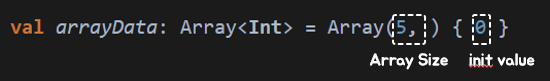

# Collection

**Collection Type**

- Array
- List
- Set
- Map


## Array, 배열



```kotlin
val arrayData: Array<Boolean> = Array(3, { false })
```

`[ ]`대괄호를 통해서 인덱스로 접근하여 값을 가져오거나, 변경할 수 있습니다.

또한, `get()`, `set()` method를 이용해서 가져오거나, 변경할 수 있습니다.

:warning:대괄호를 통하든, get을 사용하든 size를 넘어가는 index를 설정하면 `ArrayIndexOutOfBoundsException`이 발생합니다.


기초 타입의 배열을 나타내는 클래스 사용으로 제너릭으로 명시하지 않을 수도 있습니다.

- ByteArray
- ShortArray
- IntArray
- LongArray
- FloatArray
- DoubleArray
- BooleanArray
- CharArray

```kotlin
val arrayData: IntArray = IntArray(3, { 0 })
```


### arrayOf

`arrayOf()`함수를 통하면 배열을 선언할 때 값을 할당할 수도 있습니다.

```kotlin
val arrayData = arrayOf<Int>(3, 5, 7)

println(arrayData.size) // 3
println(arrayData.contentToString()) // [3, 5, 7]
```


동일하게 기초 타입의 배열을 나타내는 함수를 이용하면 제너릭으로 명시하지 않아도 됩니다.

- byteArrayOf()
- shortArrayOf()
- intArrayOf()
- longArrayOf()
- floatArrayOf()
- doubleArrayOf()
- booleanArrayOf()
- charArrayOf()

```kotlin
val arrayData = intArrayOf(3, 5, 7)
```


List, Set, Map은 Collection 인터페이스를 타입으로 표현한 클래스입니다.

Immutable(불변)과 Mutable(가변)로 나뉘어질 때,

불변은 size와 get method만 가능하며, 가변은 여기에 add와 set method도 사용할 수 있습니다.

## List, 리스트

순서가 있는 데이터 집합으로 데이터의 중복을 허용

| 타입        | 함수            | 특징 |
| ----------- | --------------- | ---- |
| List        | listOf()        | 불변 |
| MutableList | mutableListOf() | 가변 |


## Set, 집합

순서가 없으며 데이터의 중복 허용하지 않음

| 타입        | 함수            | 특징 |
| ----------- | --------------- | ---- |
| Set        | setOf()        | 불변 |
| MutableSet | mutableSetOf() | 가변 |


## Map, 맵

키와 값으로 이루어진 데이터 집합으로 순서가 없으며 키의 중복 허용하지 않음

| 타입        | 함수            | 특징 |
| ----------- | --------------- | ---- |
| Map        | mapOf()        | 불변 |
| MutableMap | mutableMapOf() | 가변 |

```kotlin
var map = mapOf<String, Int>(Pair("one", 1), "two" to 2, "three" to 3)

println(map.size)
println(map.get("two"))
```

